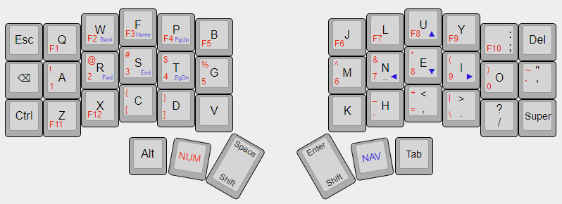

# A TKL-ish 42-key layout



### Goal

The general idea for this layout is to retain most
of the muscle memory built up from years of using
tenkeyless desktop boards, or laptop layouts which
are largely similar, in a 42-key split form factor.
It should also adapt easily to non-split 40% or
4x12 ortho layouts like the Planck. 

This is intended to serve as an easy transition to an
ergo board for anyone coming from more traditional
layouts, in order to minimize the learning curve 
required. As such, more advanced concepts like
[home row mods](https://precondition.github.io/home-row-mods)
or dual-function keys are avoided in favor of having
dedicated keys for all modifiers, with one major
exception (more on that below).

### Base layer

```
--------------------------------------------------------------------------------
| ESC  |  Q  |  W  |  F  |  P  |  B  |     |  J  |  L  |  U  |  Y  |  ;  | DEL |
| BSPC |  A  |  R  |  S  |  T  |  G  |     |  M  |  N  |  E  |  I  |  O  |  '  |
| CTRL |  Z  |  X  |  C  |  D  |  V  |     |  K  |  H  |  ,  |  .  |  /  | GUI |
               | ALT | NUM | SHF/SPC |     | SHF/RET | NAV | TAB |
                         \-------------ADJ-------------/
```

The base layer uses Colemak-DH, but this can be
switched back to QWERTY with no issues. The modifier
keys take up mostly familiar positions on the outer
columns, and stay the same on all layers for easy
combination with numbers, symbols, and each other.
All of the modifier buttons can easily be swapped
around to individual preference, if other positions
feel more natural.

The primary "innovation" which enables the rest of
this setup is that the thumb Space and Enter keys
double as Shifts when held down. This allows for
comfortable typing of capital letters as well as
shifted symbols on any layer with either hand.
Since the layer keys are adjacent to the Shifts,
shifted symbols can be typed either using the Shift
key on the opposite hand, or by pressing a layer key
and Shift together with same thumb as a chord.

The concept is similar to the dual-thumb-key layers
in the [Seniply](https://stevep99.github.io/seniply/)
layout, except the "dual" key is just Shift fulfilling
its normal role. In order to allow for holding the
spacebar or Enter key when needed,
[quick-tap](https://zmk.dev/docs/behaviors/hold-tap#quick-tap-ms)
is enabled.

### Numbers and Symbols

```
------------------------------------------------------------------------------
|      | F1  | F2  | F3  | F4  | F5  |   | F6  | F7  | F8  | F9  | F10 |     |
|      |  1  |  2  |  3  |  4  |  5  |   |  6  |  7  |  8  |  9  |  0  |  `  |
|      | F11 | F12 |  [  |  ]  |     |   |     |  -  |  =  |  \  |     |     |
                   |     |     |     |   |     |     |     |
```

Rather than creating a numpad layout for numerals
and inventing symbol locations from scratch, we just
place a number row straight across the home row, and
use Shift to access the standard associated symbols.
The F-keys also go on the same layer, above the 
number row as usual. 

Only the farthest symbol and F-keys have to move,
to comfortable positions on the bottom row. The
backtick goes over the quote character on the base
layer, but this can be moved below the `0` key if you
prefer pinky downward curls instead of outward shift.

### Navigation layer

```
-------------------------------------------------------------------------------
|      |     | BACK| HOME| PGUP|     |   |     |     | UP  |     |     |      |
|      |     | FWD | END | PGDN|     |   |     | LT  | DN  | RT  |     |      |
|      |     |     |     |     |     |   |     |     |     |     |     |      |
                   |     |     |     |   |     |     |     |
```

The nav layer holds a standard "inverted-T" arrow
cluster on the right hand, and the left holds the
rest of the navigation buttons, as well as
browser back and forward for convenience. The
arrows can be moved to the single-row "hjkl" setup if
preferred.

I rarely use Insert so didn't place it, but that 
can be added here as well, or PrintScreen, etc. 
There's also plenty of space free for adding
preferred shortcut or launcher keys.

### Adjust layer

```
-------------------------------------------------------------------------------
| RESET|     |     |     |     |     |   |BASE |VL_UP|PREV |BR_UP|     |      |
| BTCLR| BT1 | BT2 | BT3 | BT4 | BT5 |   |GAME |VL_DN|NEXT |BR_DN|     |      |
| CAPS |     |     |     |     |     |   |     |MUTE | P/P |     |     |      |
                   |     |     |     |   |     |     |     |
```

This is a "combo" layer, accessed by holding down
both layer keys, and holds keyboard, machine, and
media controls. Can be customized to preference,
or even omitted entirely.

### Bonus: Game layer

```
---------------------------------------------------------------------------------
| TAB  |  Q  |  W  |  E  |  R  |  T  |     |  Y  |  U  |  I  |  O  |  P  | BSPC |
| SHFT |  A  |  S  |  D  |  F  |  G  |     |  H  |  J  |  K  |  L  |  ;  |  '   |
| CTRL |  Z  |  X  |  C  |  V  |  B  |     |  N  |  M  |  ,  |  .  |  /  | GUI  |
                   | ALT | NUM | SPC |     | RET | NAV | ESC |
```

This remaps the alpha positions to the default QWERTY layout,
moves some modifiers back to more traditional positions, and
removes the mod-tap from the Space and Enter keys to allow them
to be held directly, primarily to allow the left half to be
used as a gaming keyboard without needing to remap everything.
The 1-5 numeral and F-keys are easily accessible via the NUM layer.

This layer is numerically below all layers except the base so they
can still be used normally, and is toggled via the Adjust layer.
